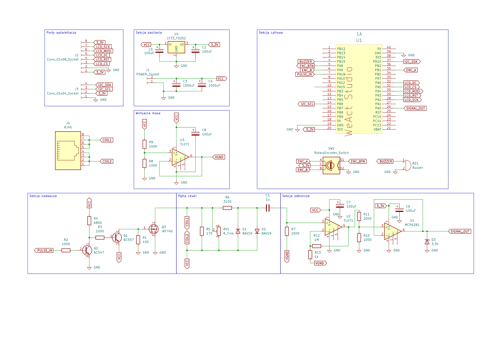

# KiCadToPNG

Small tool I created while writing my engineering thesis.

Allows you to goenerate transparent PNG files from KiCad schematics.

Every section gets automatically split, allowing you to embed them to
embed and automatically regenerate important sections of the schematic into your document




## Usage

```bash
❯ uv tool install git+https://github.com/PawelReich/kicadtopng
❯ kicadtopng GitKop.kicad_sch -o sections/
```
